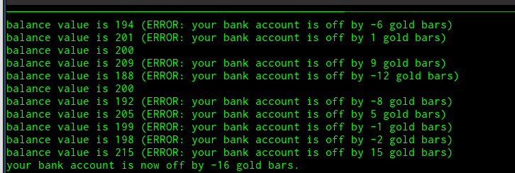

# Python Multiprocessing / Multithreading

Code examples from [this playlist](https://www.youtube.com/playlist?list=PLeo1K3hjS3uub3PRhdoCTY8BxMKSW7RjN).

I modified the code a bit while experimenting.

Watch out for mutating shared vars:

